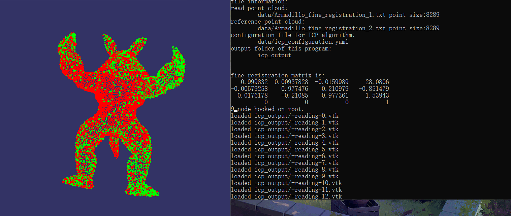

# fine_registration

The goal of this program is to fine registration two point cloud based on Iterative Closest Point (ICP), which mainly implemented by `libpointmatcher`. And it can visualize the process of ICP registration using OSG.

Thanks to `libpointmatcher,` which did an entirely meaningful work in this field, it also helps me learn iterative closest point algorithm deeply.

## Requirement

- OpenSceneGraph(OSG) 3.6.4
- libpointmatcher with `yaml-cpp-pm`

## Demo



## Usage

``` shell
xxx.exe <reading_point_cloud.txt> <reference_point_cloud.txt> <icp_configruation_file.yaml> <icp_output_folder> 
```

## Configuration file for ICP alogrithm

For a good understanding of configuration, here are notes for using `libpointmatcher` properly:

1. Empty configuration file:

    ``` yaml
    readingDataPointsFilters:
    - IdentityDataPointsFilter
    referenceDataPointsFilters:
    - IdentityDataPointsFilter
    matcher:
    KDTreeMatcher
    outlierFilters:
    - NullOutlierFilter
    errorMinimizer:
    IdentityErrorMinimizer
    transformationCheckers:
    - CounterTransformationChecker
    inspector:
    NullInspector
    logger:
    FileLogger
    ```

2. A tutorial configuration file:

    ``` yaml
    readingDataPointsFilters:
    - RandomSamplingDataPointsFilter:
        prob: 0.5
    referenceDataPointsFilters:
    - SamplingSurfaceNormalDataPointsFilter:
        knn: 10
    matcher:
    KDTreeMatcher:
        knn: 1
    outlierFilters:
    - TrimmedDistOutlierFilter:
        ratio: 0.95
    errorMinimizer:
    PointToPlaneErrorMinimizer
    transformationCheckers:
    - CounterTransformationChecker:
        maxIterationCount: 40
    - DifferentialTransformationChecker:
        minDiffRotErr: 0.001
        minDiffTransErr: 0.01
        smoothLength: 4 
    inspector:
    VTKFileInspector:
        baseFileName : vissteps
        dumpDataLinks : 1
        dumpReading : 1
        dumpReference : 1
    logger:
    FileLogger
    ```

3. Definition of items:

    | Module Name | Possible Components | Default Components | Is a List |
    |:------------|:--------------------|:-------------------|:----------|
    |readingDataPointsFilters| BoundingBoxDataPointsFilter <br>FixStepSamplingDataPointsFilter<br>MaxDensityDataPointsFilter <br>MaxDistDataPointsFilter <br>MaxPointCountDataPointsFilter<br>MaxQuantileOnAxisDataPointsFilter<br>MinDistDataPointsFilter<br>ObservationDirectionDataPointsFilter<br>OrientNormalsDataPointsFilter<br>RandomSamplingDataPointsFilter<br>RemoveNaNDataPointsFilter<br>SamplingSurfaceNormalDataPointsFilter<br>ShadowDataPointsFilter<br>SimpleSensorNoiseDataPointsFilter<br>SurfaceNormalDataPointsFilter | RandomSamplingDataPointsFilter | Yes |
    |referenceDataPointsFilters| BoundingBoxDataPointsFilter <br>FixStepSamplingDataPointsFilter<br>MaxDensityDataPointsFilter <br>MaxDistDataPointsFilter <br>MaxPointCountDataPointsFilter<br>MaxQuantileOnAxisDataPointsFilter<br>MinDistDataPointsFilter<br>ObservationDirectionDataPointsFilter<br>OrientNormalsDataPointsFilter<br>RandomSamplingDataPointsFilter<br>RemoveNaNDataPointsFilter<br>SamplingSurfaceNormalDataPointsFilter<br>ShadowDataPointsFilter<br>SimpleSensorNoiseDataPointsFilter<br>SurfaceNormalDataPointsFilter | SamplingSurfaceNormalDataPointsFilter | Yes |
    |matcher | KDTreeMatcher<br>KDTreeVarDistMatcher | KDTreeMatcher | No |
    | outlierFilters | MaxDistOutlierFilter<br>MedianDistOutlierFilter<br>MinDistOutlierFilter<br>SurfaceNormalOutlierFilter<br>TrimmedDistOutlierFilter<br>VarTrimmedDistOutlierFilter | TrimmedDistOutlierFilter | Yes |
    | errorMinimizer | IdentityErrorMinimizer<br>PointToPlaneErrorMinimizer<br>PointToPointErrorMinimizer | PointToPlaneErrorMinimizer | No |
    | transformationCheckers | BoundTransformationChecker<br>CounterTransformationChecker<br>DifferentialTransformationChecker | CounterTransformationChecker<br>DifferentialTransformationChecker | Yes |
    | inspector | NullInspector<br>PerformanceInspector<br>VTKFileInspector | NullInspector | No|
    | logger | // nothing was shown on screen <br> NullLogger<br> // log info will be printed on screen <br>FileLogger  | NullLogger | No |

4. Transformation Checkers

    The counter checker automatically stops the ICP loop after a maximum of 40 iterations. **The differential transformation checker** stops the ICP loop when the relative transformation motions between iterations is below a threshold. In other words, when each subsequent iteration produces little change in the transformation, then the algorithm is stopped. Because the relative motions are generally prone to jagged oscillations, smoothing is applied by taking the average the relative differences over several iterations.

    In addition to a limit on the total number of iterations, an additional constraint is added to the transformations. A threshold on the rotational and translational relative transformation changes is defined between iterations. These values are smoothed with the smoothLength parameter by taking the averages of these changes every 4 iterations. If the change in the transformation is below this threshold, the algorithm is stopped. This is to enforce convergence towards a local optimum and to prevent oscillations.

5. Matcher

   - KDTreeMatcher: This matcher matches a point from the reading to its closest neighbors in the reference.
     - knn (default: 1) - number of nearest neighbors to consider it the reference - min: 1 - max: 2147483647
     - epsilon (default: 0) - approximation to use for the nearest-neighbor search - min: 0 - max: inf
     - searchType (default: 1) - Nabo search type. 0: brute force, check distance to every point in the data (very slow), 1: kd-tree with linear heap, good for small knn (~up to 30) and 2: kd-tree with tree heap, good for large knn (~from 30) - min: 0 - max: 2
     - maxDist (default: inf) - maximum distance to consider for neighbors - min: 0 - max: inf
   - KDTreeVarDistMatcher: This matcher matches a point from the reading to its closest neighbors in the reference.**A maximum search radius per point can be defined.**
      - knn (default: 1) - number of nearest neighbors to consider it the reference - min: 1 - max: 2147483647
      - epsilon (default: 0) - approximation to use for the nearest-neighbor search - min: 0 - max: inf
      - searchType (default: 1) - Nabo search type. 0: brute force, check distance to every point in the data (very slow), 1: kd-tree with linear heap, good for small knn (~up to 30) and 2: kd-tree with tree heap, good for large knn (~from 30) - min: 0 - max: 2
      - maxDistField (default: maxSearchDist) - descriptor field name used to set a maximum distance to consider for neighbors per point
   - NullMatcher: Does nothing, returns no match.

6. ErrorMinimizer

    - IdentityErrorMinimizer: Does nothing.
    - PointToPlaneErrorMinimizer: Point-to-plane error (or point-to-line in 2D)
      - force2D (default: 0) - If set to true(1), the minimization will be force to give a solution in 2D (i.e., on the XY-plane) even with 3D inputs. - min: 0 - max: 1
    - PointToPlaneWithCovErrorMinimizer
Point-to-plane error (or point-to-line in 2D).
      - force2D (default: 0) - If set to true(1), the minimization will be force to give a solution in 2D (i.e., on the XY-plane) even with 3D inputs. - min: 0 - max: 1
      - sensorStdDev (default: 0.01) - sensor standard deviation - min: 0. - max: inf
    - PointToPointErrorMinimizer:Point-to-point error. Based on SVD decomposition.
    - PointToPointSimilarityErrorMinimizer: Point-to-point similarity error (rotation + translation + scale). The scale is the same for all coordinates. Based on SVD decomposition.
    - PointToPointWithCovErrorMinimizer: Point-to-point error. Based on SVD decomposition.
      - sensorStdDev (default: 0.01) - sensor standard deviation - min: 0. - max: inf

7. TransformationChecker 

    - BoundTransformationChecker: This checker stops the ICP loop with an exception when the transformation values exceed bounds.
      - maxRotationNorm (default: 1) - rotation bound - min: 0 - max: inf
      - maxTranslationNorm (default: 1) - translation bound - min: 0 - max: inf
    - CounterTransformationChecker: This checker stops the ICP loop after a certain number of iterations.
      - maxIterationCount (default: 40) 
      - maximum number of iterations  - min: 0 - max: 2147483647
    - DifferentialTransformationChecker: This checker stops the ICP loop when the relative motions (i.e. abs(currentIter - lastIter)) of rotation and translation components are below a fix thresholds. This allows to stop the iteration when the point cloud is stabilized. Smoothing can be applied to avoid oscillations. Inspired by [6].
      - minDiffRotErr (default: 0.001) - threshold for rotation error (radian) - min: 0. - max: 6.2831854
      - minDiffTransErr (default: 0.001) - threshold for translation error - min: 0. - max: inf
      - smoothLength (default: 3) - number of iterations over which to average the differencial error - min: 0 - max: 2147483647

8. Inspector 

    - NullInspector: Does nothing.
    - PerformanceInspector: Keep statistics on performance.
      - baseFileName (default: ) - base file name for the statistics files (if empty, disabled)
      - dumpPerfOnExit (default: 0) - dump performance statistics to stderr on exit
      - dumpStats (default: 0) - dump the statistics on first and last step
    - VTKFileInspector:Dump the different steps into VTK files.
      - baseFileName (default: point-matcher-output) - base file name for the VTK files 
      - dumpPerfOnExit (default: 0) - dump performance statistics to stderr on exit
      - dumpStats (default: 0) - dump the statistics on first and last step
      - dumpIterationInfo (default: 0) - dump iteration info
      - dumpDataLinks (default: 0) - dump data links at each iteration
      - dumpReading (default: 0) - dump the reading cloud at each iteration
      - dumpReference (default: 0) - dump the reference cloud at each iteration
      - writeBinary (default: 0) - write binary VTK files

9. Logger 
    - FileLogger: Log using std::stream.
      - infoFileName (default: ) - name of the file to output infos to, or an empty string to output infos to the standard output stream
      - warningFileName (default: ) - name of the file to output warnings to, or an empty string to output warnings to the standard error stream
      - displayLocation (default: 0) - display the location of message in source code
    - NullLogger: Does not log anything.