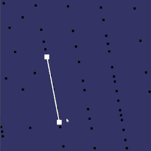
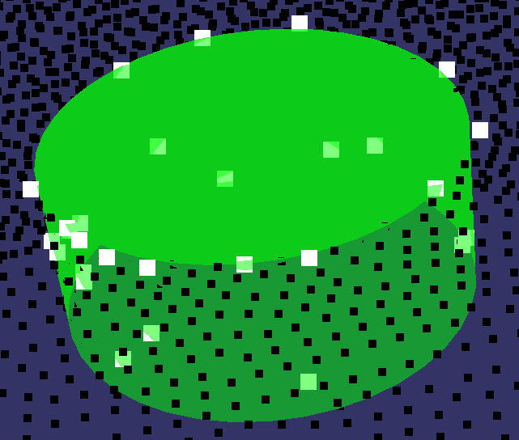

# Labeling points to be detected

The purpose of this stage is to select a bunch of points that could represent the shape to be detected while fitting and showing it on screen in real-time for checking.

## Requirements

- OpenSceneGraph(OSG) 3.6.4

- The Computational Geometry Algorithms Library(CGAL) 5.0.2

## Progress & Record

- [x] Fitting line & showing
- [x] Fitting plane & showing
- [x] Fitting cylinder & showing // TODO
- [x] Supported export to file

## Usage

1. command

    ``` shell
    ./main_labeling_points.cpp  <point_cloud> <output_folder>
    ```

2. file structure \
    labeled or marked points will be saved in `output/`, which should consist of these file as following:

    ``` shell
    cylinder_marked.txt
    line_marked.txt
    plane_marked.txt
    point_marked.txt
    ```

3. menu

    Now supported menu in console

    ``` shell
    a) 3d point
    b) 3d line
    c) 3d plane
    d) 3d cylinder
    s) show all shapes marked
    e) export all marked points
    ```

## Demo in each stage


